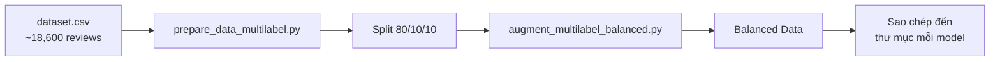
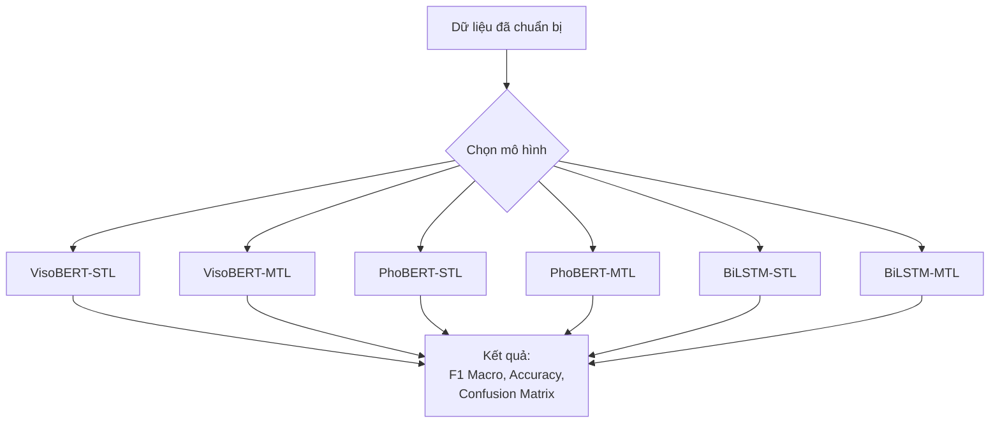

# 🇻🇳 Vietnamese Aspect-Based Sentiment Analysis (ABSA)

> **Hệ thống phân tích cảm xúc theo khía cạnh cho đánh giá điện thoại tiếng Việt trên Shopee**

---

## 📋 Mục lục

- [Tổng quan](#-tổng-quan)
- [Dataset](#-dataset)
- [Cấu trúc Project](#-cấu-trúc-project)
- [Cài đặt](#-cài-đặt)
- [Chuẩn bị dữ liệu](#-chuẩn-bị-dữ-liệu)
- [Huấn luyện mô hình](#-huấn-luyện-mô-hình)
- [Kiến trúc mô hình](#-kiến-trúc-mô-hình)
- [Loss Functions](#-loss-functions)
- [Đánh giá](#-đánh-giá)
- [So sánh các mô hình](#-so-sánh-các-mô-hình)

---

## 🎯 Tổng quan

Project này xây dựng hệ thống **Aspect-Based Sentiment Analysis (ABSA)** cho tiếng Việt, thực hiện **2 task chính**:

| Task | Mô tả | Output |
|------|--------|--------|
| **Aspect Detection (AD)** | Phát hiện các khía cạnh được đề cập trong review | Binary (có/không) cho mỗi aspect |
| **Sentiment Classification (SC)** | Phân loại cảm xúc cho từng khía cạnh | Positive / Negative / Neutral |

### 11 Khía cạnh (Aspects)

| # | Aspect | Mô tả |
|---|--------|--------|
| 1 | **Battery** | Thời lượng pin, sạc pin |
| 2 | **Camera** | Chất lượng camera, chụp ảnh, quay video |
| 3 | **Performance** | Hiệu năng, tốc độ xử lý, lag/giật |
| 4 | **Display** | Màn hình, độ sáng, độ phân giải |
| 5 | **Design** | Thiết kế, ngoại hình, vật liệu |
| 6 | **Packaging** | Đóng gói, phụ kiện kèm theo |
| 7 | **Price** | Giá cả, giá trị sử dụng |
| 8 | **Shop_Service** | Dịch vụ cửa hàng, chăm sóc khách hàng |
| 9 | **Shipping** | Giao hàng, vận chuyển |
| 10 | **General** | Nhận xét chung về sản phẩm |
| 11 | **Others** | Khác (chỉ phát hiện AD, không phân loại SC) |

### 6 Mô hình được triển khai

| # | Mô hình | Backbone | Phương pháp |
|---|---------|----------|-------------|
| 1 | **VisoBERT-STL** | ViSoBERT (~110M params) | Single-Task Learning |
| 2 | **VisoBERT-MTL** | ViSoBERT (~110M params) | Multi-Task Learning |
| 3 | **PhoBERT-STL** | PhoBERT (~135M params) | Single-Task Learning |
| 4 | **PhoBERT-MTL** | PhoBERT (~135M params) | Multi-Task Learning |
| 5 | **BiLSTM-STL** | Trainable Embeddings | Single-Task Learning |
| 6 | **BiLSTM-MTL** | Trainable Embeddings | Multi-Task Learning |

---

## 📊 Dataset

### Thông tin chung

- **File**: `dataset.csv`
- **Số lượng**: ~18,600 review điện thoại tiếng Việt
- **Nguồn**: Shopee (sàn thương mại điện tử)
- **Ngôn ngữ**: Tiếng Việt

### Cấu trúc dữ liệu

| Cột | Kiểu | Mô tả |
|-----|------|--------|
| `data` | text | Nội dung review tiếng Việt gốc |
| `Battery` ... `Others` | categorical | Nhãn cảm xúc cho từng khía cạnh |

**Giá trị nhãn cho mỗi khía cạnh:**
- `Positive` — Đánh giá tích cực
- `Negative` — Đánh giá tiêu cực
- `Neutral` — Đánh giá trung tính
- *(trống)* — Không đề cập đến khía cạnh đó

### Ví dụ

| Review | Battery | Camera | Performance | Price |
|--------|---------|--------|-------------|-------|
| *"Pin trâu, cam nét, chơi game mượt"* | Positive | Positive | Positive | |
| *"Giao hàng chậm, giá đắt"* | | | | Negative |
| *"Máy ổn trong tầm giá"* | | | | Positive |

---

## 📁 Cấu trúc Project

```
BERT-main/
│
├── 📊 Dataset & Chuẩn bị dữ liệu
│   ├── dataset.csv                          # Dataset gốc (~18,600 samples)
│   ├── prepare_data_multilabel.py           # Chia train/val/test (80/10/10)
│   ├── augment_multilabel_balanced.py       # Oversampling cân bằng dữ liệu
│   ├── run_data_preparation.sh              # Script chạy toàn bộ pipeline
│   ├── remove_empty_samples.py              # Loại bỏ mẫu trống
│   └── requirements.txt                     # Dependencies
│
├── 🤖 VisoBERT-STL/                         # VisoBERT Single-Task Learning
│   ├── train_visobert_stl.py                # Script huấn luyện 2 giai đoạn
│   ├── model_visobert_ad.py                 # Model Aspect Detection
│   ├── model_visobert_sc.py                 # Model Sentiment Classification
│   ├── dataset_visobert_ad.py               # Dataset cho AD
│   ├── dataset_visobert_sc.py               # Dataset cho SC
│   ├── focal_loss_multilabel.py             # Focal Loss implementation
│   ├── config_visobert_stl.yaml             # Cấu hình
│   └── data/                                # Dữ liệu đã xử lý
│
├── 🤖 VisoBERT-MTL/                         # VisoBERT Multi-Task Learning
│   ├── train_visobert_mtl.py                # Script huấn luyện joint training
│   ├── model_visobert_mtl.py                # Model shared backbone + 2 heads
│   ├── dataset_visobert_mtl.py              # Dataset cho MTL
│   ├── focal_loss_multilabel.py             # Focal Loss implementation
│   ├── config_visobert_mtl.yaml             # Cấu hình
│   └── data/                                # Dữ liệu đã xử lý
│
├── 🤖 PhoBERT-STL/                          # PhoBERT Single-Task Learning
│   ├── train_phobert_stl.py                 # Script huấn luyện 2 giai đoạn
│   ├── model_phobert_ad.py                  # Model AD
│   ├── model_phobert_sc.py                  # Model SC
│   ├── config_phobert_stl.yaml              # Cấu hình
│   └── data/                                # Dữ liệu đã xử lý
│
├── 🤖 phoBERT-MTL/                          # PhoBERT Multi-Task Learning
│   ├── train_phobert_mtl.py                 # Script huấn luyện joint training
│   ├── model_phobert_mtl.py                 # Model shared backbone + 2 heads
│   ├── config_phobert_mtl.yaml              # Cấu hình
│   └── data/                                # Dữ liệu đã xử lý
│
├── 🤖 BILSTM-STL/                           # BiLSTM Single-Task Learning
│   ├── train_two_stage_bilstm.py            # Script huấn luyện 2 giai đoạn
│   ├── model_bilstm_ad.py                   # Model AD
│   ├── model_bilstm_sc.py                   # Model SC
│   ├── config_bilstm_stl.yaml               # Cấu hình
│   └── data/                                # Dữ liệu đã xử lý
│
├── 🤖 BILSTM-MTL/                           # BiLSTM Multi-Task Learning
│   ├── train_bilstm_mtl.py                  # Script huấn luyện joint training
│   ├── model_bilstm_mtl.py                  # Model shared backbone + 2 heads
│   ├── config_bilstm_mtl.yaml               # Cấu hình
│   └── data/                                # Dữ liệu đã xử lý
│
├── 📈 Phân tích & Đánh giá
│   ├── run_error_analysis.py                # Phân tích lỗi chi tiết
│   ├── check_augmentation_result.py         # Kiểm tra kết quả augmentation
│   ├── check_alpha_weights.py               # Kiểm tra trọng số focal loss
│   ├── check_price_distribution.py          # Kiểm tra phân bố dữ liệu
│   ├── compare_oversampling.py              # So sánh các chiến lược oversampling
│   ├── visualize_augment_comparison.py      # Trực quan hóa kết quả augmentation
│   └── single_label/                        # Phương pháp single-label (legacy)
│
└── dataset/
    └── dataset.csv                          # Bản sao dataset
```

---

## ⚙️ Cài đặt

> 💡 Hướng dẫn dưới đây dành cho môi trường **Linux** (Kaggle Notebook / Google Colab).

### Trên Kaggle / Google Colab

```bash
# Upload project lên Kaggle Dataset hoặc Google Drive, sau đó:
!pip install -r requirements.txt
```

### Trên máy Linux

```bash
# Clone repository
git clone <repository-url>
cd BERT-main

# Tạo môi trường ảo
python -m venv venv
source venv/bin/activate

# Cài đặt dependencies
pip install -r requirements.txt
```

### Cài đặt PyTorch với CUDA (nếu chưa có)

```bash
# CUDA 11.8
pip install torch torchvision torchaudio --index-url https://download.pytorch.org/whl/cu118

# CUDA 12.1
pip install torch torchvision torchaudio --index-url https://download.pytorch.org/whl/cu121
```

### Danh sách dependencies chính

| Package | Version | Mô tả |
|---------|---------|--------|
| `torch` | >= 2.0.0 | Deep Learning framework |
| `transformers` | >= 4.30.0 | Hugging Face Transformers |
| `datasets` | >= 2.12.0 | Hugging Face Datasets |
| `accelerate` | >= 0.20.0 | Training acceleration |
| `pandas` | >= 2.0.0 | Data processing |
| `numpy` | >= 1.24.0 | Numerical computing |
| `scikit-learn` | >= 1.3.0 | ML metrics |
| `matplotlib` | >= 3.7.0 | Visualization |
| `seaborn` | >= 0.12.0 | Statistical visualization |
| `pyyaml` | >= 6.0 | Configuration files |
| `sentencepiece` | >= 0.1.99 | Tokenizer |

### Xác minh cài đặt

```python
import torch
print(f"PyTorch: {torch.__version__}")
print(f"CUDA available: {torch.cuda.is_available()}")
print(f"GPU: {torch.cuda.get_device_name(0) if torch.cuda.is_available() else 'N/A'}")

import transformers
print(f"Transformers: {transformers.__version__}")
```

---

## 🔄 Chuẩn bị dữ liệu

> ⚠️ **Bắt buộc** phải chạy bước này trước khi huấn luyện bất kỳ mô hình nào.

### Pipeline tổng quan



### Cách 1: Chạy script tự động (khuyến nghị)

```bash
bash run_data_preparation.sh
```

### Cách 2: Chạy từng bước thủ công

#### Bước 1 — Chia dữ liệu train/val/test

```bash
python prepare_data_multilabel.py
```

Script này sẽ:
1. Đọc `dataset.csv` gốc
2. Chia dữ liệu theo tỷ lệ **80% train / 10% validation / 10% test**
3. Tạo các file trong thư mục `data/` của mỗi mô hình:
   - `train_multilabel.csv`
   - `validation_multilabel.csv`
   - `test_multilabel.csv`
   - `multilabel_metadata.json`

#### Bước 2 — Cân bằng dữ liệu (Oversampling)

```bash
python augment_multilabel_balanced.py
```

Script này sẽ:
1. Đọc `train_multilabel.csv`
2. Thực hiện **oversampling** cho các class thiểu số
3. Tạo file `train_multilabel_balanced.csv` trong mỗi thư mục model

### Dữ liệu sau khi chuẩn bị

Mỗi thư mục model (`VisoBERT-STL/data/`, `VisoBERT-MTL/data/`, ...) sẽ chứa:

```
data/
├── train_multilabel.csv            # Dữ liệu train gốc
├── train_multilabel_balanced.csv   # Dữ liệu train đã cân bằng
├── validation_multilabel.csv       # Dữ liệu validation
├── test_multilabel.csv             # Dữ liệu test
└── multilabel_metadata.json        # Thống kê metadata
```

---

## 🚀 Huấn luyện mô hình

> 💡 Tất cả lệnh đều chạy từ thư mục **gốc** của project (`BERT-main/`).

### Tổng quan 6 mô hình



---

### 1️⃣ VisoBERT-STL (Single-Task Learning)

> Huấn luyện 2 giai đoạn tuần tự — Aspect Detection trước, Sentiment Classification sau. Backbone: `5CD-AI/visobert-14gb-corpus`.

```bash
python VisoBERT-STL/train_visobert_stl.py --config VisoBERT-STL/config_visobert_stl.yaml
```

**Quá trình huấn luyện:**
1. **Stage 1 — AD**: 12 epochs, Binary Focal Loss, 11 outputs
2. **Stage 2 — SC**: 12 epochs, Focal Loss, 10 × 3 outputs (loại trừ Others)

| Tham số | Giá trị |
|---------|---------|
| Pretrained model | `5CD-AI/visobert-14gb-corpus` |
| Learning rate | `2e-5` |
| Batch size | `16` |
| Max length | `256` |
| Hidden size | `512` |
| Dropout | `0.3` |
| AD epochs | `12` |
| SC epochs | `12` |
| Early stopping | `2` epochs patience |

**Output:**
```
VisoBERT-STL/
├── models/
│   ├── aspect_detection/       # Best AD model + logs
│   └── sentiment_classification/ # Best SC model + logs
└── results/
    └── two_stage_training/     # Final report + confusion matrices
```

---

### 2️⃣ VisoBERT-MTL (Multi-Task Learning) ⭐ Khuyến nghị

> Huấn luyện đồng thời AD và SC với shared ViSoBERT backbone. Combined Loss = α × Focal_AD + β × Focal_SC.

```bash
python VisoBERT-MTL/train_visobert_mtl.py --config VisoBERT-MTL/config_visobert_mtl.yaml
```

| Tham số | Giá trị |
|---------|---------|
| Pretrained model | `5CD-AI/visobert-14gb-corpus` |
| Learning rate | `2e-5` |
| Batch size | `16` |
| Gradient accumulation | `2` steps |
| Max length | `256` |
| Epochs | `12` |
| LR scheduler | `cosine` |
| Warmup ratio | `0.06` |
| Loss weight AD (α) | `1.0` |
| Loss weight SC (β) | `1.0` |
| Best model metric | `combined_f1` |
| Early stopping | `3` epochs patience |
| FP16 | Enabled |

**Output:**
```
VisoBERT-MTL/
├── models/mtl/        # Best model checkpoint
└── results/           # Final report + confusion matrices
```

---

### 3️⃣ PhoBERT-STL (Single-Task Learning)

> Tương tự VisoBERT-STL nhưng sử dụng `vinai/phobert-base` làm backbone.

```bash
python PhoBERT-STL/train_phobert_stl.py --config PhoBERT-STL/config_phobert_stl.yaml
```

| Tham số | Giá trị |
|---------|---------|
| Pretrained model | `vinai/phobert-base` |
| Learning rate | `2e-5` |
| Batch size | `16` |
| Gradient accumulation | `4` steps |
| Optimizer | `adamw_bnb_8bit` |
| LR scheduler | `cosine` |
| FP16 | Enabled |
| AD epochs | `1` |
| SC epochs | `10` |
| Early stopping | `5` epochs patience |

**Output:**
```
PhoBERT-STL/
├── models/
│   ├── aspect_detection/
│   └── sentiment_classification/
└── results/
    └── two_stage_training/
```

---

### 4️⃣ PhoBERT-MTL (Multi-Task Learning)

> Huấn luyện đồng thời AD và SC với shared PhoBERT backbone.

```bash
python phoBERT-MTL/train_phobert_mtl.py --config phoBERT-MTL/config_phobert_mtl.yaml
```

| Tham số | Giá trị |
|---------|---------|
| Pretrained model | `vinai/phobert-base` |
| Learning rate | `2e-5` |
| Batch size | `16` |
| Gradient accumulation | `2` steps |
| Epochs | `12` |
| LR scheduler | `cosine` |
| Loss weight AD (α) | `1.0` |
| Loss weight SC (β) | `1.0` |
| Best model metric | `combined_f1` |
| Early stopping | `3` epochs patience |
| FP16 | Enabled |

**Output:**
```
phoBERT-MTL/
├── models/mtl/
└── results/
```

---

### 5️⃣ BiLSTM-STL (Single-Task Learning)

> Huấn luyện 2 giai đoạn với kiến trúc BiLSTM + CNN. Sử dụng trainable embeddings (không pretrained), nhẹ hơn BERT models.

```bash
python BILSTM-STL/train_two_stage_bilstm.py --config BILSTM-STL/config_bilstm_stl.yaml
```

| Tham số | Giá trị |
|---------|---------|
| Tokenizer | `5CD-AI/visobert-14gb-corpus` (chỉ tokenize) |
| Embedding dim | `300` (trainable) |
| LSTM hidden | `256` |
| LSTM layers | `2` |
| Conv1D filters | `128` |
| Learning rate | `3e-4` |
| Batch size | `32` |
| AD epochs | `70` |
| SC epochs | `70` |
| AD early stopping | `5` epochs |
| SC early stopping | `7` epochs |
| FP16 | Enabled |

**Output:**
```
BILSTM-STL/
├── models/
│   ├── aspect_detection/
│   └── sentiment_classification/
└── results/
    └── two_stage_training/
```

---

### 6️⃣ BiLSTM-MTL (Multi-Task Learning)

> Huấn luyện đồng thời AD và SC với shared BiLSTM + CNN backbone.

```bash
python BILSTM-MTL/train_bilstm_mtl.py --config BILSTM-MTL/config_bilstm_mtl.yaml
```

| Tham số | Giá trị |
|---------|---------|
| Tokenizer | `5CD-AI/visobert-14gb-corpus` (chỉ tokenize) |
| Embedding dim | `300` (trainable) |
| LSTM hidden | `256` |
| LSTM layers | `2` |
| Conv1D filters | `128` |
| Learning rate | `3e-4` |
| Batch size | `32` |
| Epochs | `30` |
| Loss weight AD (α) | `1.0` |
| Loss weight SC (β) | `1.0` |
| Best model metric | `combined` |
| Early stopping | `7` epochs patience |
| FP16 | Enabled |

**Output:**
```
BILSTM-MTL/
├── models/mtl/
└── results/
```

---

### 📌 Bảng tóm tắt lệnh chạy

| # | Mô hình | Lệnh |
|---|---------|-------|
| 1 | VisoBERT-STL | `python VisoBERT-STL/train_visobert_stl.py --config VisoBERT-STL/config_visobert_stl.yaml` |
| 2 | VisoBERT-MTL ⭐ | `python VisoBERT-MTL/train_visobert_mtl.py --config VisoBERT-MTL/config_visobert_mtl.yaml` |
| 3 | PhoBERT-STL | `python PhoBERT-STL/train_phobert_stl.py --config PhoBERT-STL/config_phobert_stl.yaml` |
| 4 | PhoBERT-MTL | `python phoBERT-MTL/train_phobert_mtl.py --config phoBERT-MTL/config_phobert_mtl.yaml` |
| 5 | BiLSTM-STL | `python BILSTM-STL/train_two_stage_bilstm.py --config BILSTM-STL/config_bilstm_stl.yaml` |
| 6 | BiLSTM-MTL | `python BILSTM-MTL/train_bilstm_mtl.py --config BILSTM-MTL/config_bilstm_mtl.yaml` |

---

## 🧠 Kiến trúc mô hình

### STL — Single-Task Learning (Huấn luyện tuần tự)

```
                    Input Text (Review tiếng Việt)
                              │
                ┌─────────────┴──────────────┐
                ▼                            ▼
        ╔═══════════════╗           ╔═══════════════╗
        ║   Stage 1     ║           ║   Stage 2     ║
        ║   AD Model    ║           ║   SC Model    ║
        ╠═══════════════╣           ╠═══════════════╣
        ║  BERT/BiLSTM  ║           ║  BERT/BiLSTM  ║
        ║  Backbone     ║           ║  Backbone     ║
        ║      ↓        ║           ║      ↓        ║
        ║  Dense Layer  ║           ║  Dense Layer  ║
        ║      ↓        ║           ║      ↓        ║
        ║  11 Sigmoids  ║           ║  10 × Softmax ║
        ║  (Binary)     ║           ║  (3-class)    ║
        ╚═══════════════╝           ╚═══════════════╝
         Binary Focal Loss          Multi-class Focal Loss
         → Train trước              → Train sau
```

### MTL — Multi-Task Learning (Huấn luyện đồng thời)

```
                    Input Text (Review tiếng Việt)
                              │
                ╔═════════════╧══════════════╗
                ║   Shared BERT/BiLSTM       ║
                ║   Backbone (Chung)         ║
                ║      [CLS] Embedding       ║
                ╚═════════════╤══════════════╝
                              │
                ┌─────────────┴──────────────┐
                ▼                            ▼
        ╔═══════════════╗           ╔═══════════════╗
        ║   AD Head     ║           ║   SC Head     ║
        ║   Dense → 11  ║           ║ Dense → 11×3  ║
        ║   Sigmoids    ║           ║   Softmax     ║
        ╚═══════════════╝           ╚═══════════════╝
        
        Combined Loss = α × Focal_AD + β × Focal_SC
```

---

## 📉 Loss Functions

### Focal Loss (Xử lý Class Imbalance)

```
FL(p) = -α × (1 - p)^γ × log(p)
```

| Tham số | Giá trị | Mô tả |
|---------|---------|--------|
| `γ (gamma)` | `2.0` | Tăng trọng số cho hard examples (mẫu khó) |
| `α (alpha)` | `auto` | Tự động tính từ nghịch đảo tần suất class |

### Multi-Task Loss (cho MTL)

```
Total Loss = α × Focal_AD + β × Focal_SC
```

- **AD Loss**: Binary Focal Loss (11 outputs — có/không cho mỗi aspect)
- **SC Loss**: Multi-class Focal Loss (11 × 3 outputs — Pos/Neg/Neu cho mỗi aspect)
- **α, β**: Trọng số loss, mặc định đều = `1.0`

---

## 📈 Đánh giá

### Metrics

| Metric | Task | Mô tả |
|--------|------|--------|
| **F1 Macro** | AD, SC | Trung bình F1 không có trọng số qua tất cả aspects |
| **Accuracy** | SC | Độ chính xác cho từng aspect |
| **Precision** | AD, SC | Tỷ lệ dự đoán đúng trên tổng dự đoán |
| **Recall** | AD, SC | Tỷ lệ dự đoán đúng trên tổng thực tế |

**Tiêu chí chọn model tốt nhất (MTL):**
```
combined_f1 = mean(AD_F1_Macro, SC_F1_Macro)
```

### Phân tích lỗi

```bash
python run_error_analysis.py
```

### Output kết quả

Sau khi huấn luyện, mỗi mô hình sẽ tạo ra:

- **Model checkpoints** — Best model weights (`.pt` files)
- **Training logs** — Log chi tiết quá trình huấn luyện
- **Confusion matrices** — Ma trận nhầm lẫn cho từng aspect
- **Final report** — Báo cáo tổng hợp metrics (`.txt` file)
- **Predictions** — Kết quả dự đoán trên test set (`.csv` file)

---

## 🔧 So sánh các mô hình

| Mô hình | Backbone | Phương pháp | Ưu điểm | Nhược điểm |
|---------|----------|-------------|----------|------------|
| **VisoBERT-STL** | ViSoBERT | Tuần tự | Tối ưu riêng biệt, dễ debug | Không chia sẻ kiến thức giữa AD↔SC |
| **VisoBERT-MTL** | ViSoBERT | Đồng thời | Chia sẻ đặc trưng ngữ nghĩa, train nhanh hơn | Cần điều chỉnh hyperparameter phức tạp hơn |
| **PhoBERT-STL** | PhoBERT | Tuần tự | Backbone mạnh cho tiếng Việt | Không chia sẻ kiến thức |
| **PhoBERT-MTL** | PhoBERT | Đồng thời | Chia sẻ đặc trưng, tổng quát | Cần tune loss weights |
| **BiLSTM-STL** | Trainable | Tuần tự | Nhẹ, nhanh, ít tài nguyên | Accuracy thấp hơn BERT |
| **BiLSTM-MTL** | Trainable | Đồng thời | Nhẹ nhất, inference nhanh | Accuracy thấp nhất |

### Pretrained Models

| Model | HuggingFace Hub | Params |
|-------|-----------------|--------|
| ViSoBERT | `5CD-AI/visobert-14gb-corpus` | ~110M |
| PhoBERT | `vinai/phobert-base` | ~135M |

---

## 🔁 Quick Start

```bash
# 1. Cài đặt dependencies
pip install -r requirements.txt

# 2. Chuẩn bị dữ liệu
bash run_data_preparation.sh
# Hoặc chạy thủ công:
# python prepare_data_multilabel.py
# python augment_multilabel_balanced.py

# 3. Train model (chọn 1 trong 6, khuyến nghị VisoBERT-MTL)
python VisoBERT-MTL/train_visobert_mtl.py --config VisoBERT-MTL/config_visobert_mtl.yaml

# 4. Xem kết quả
# Kết quả lưu trong thư mục results/ của model tương ứng
```

---

## 👥 Tác giả

Developed for Vietnamese Aspect-Based Sentiment Analysis research on smartphone reviews.

---

## 📄 License

This project is for research purposes.
